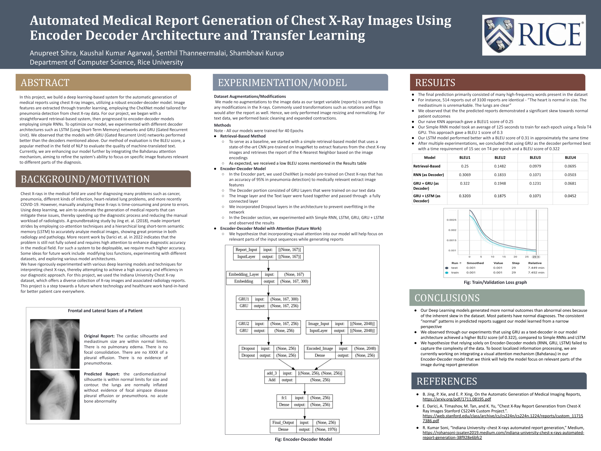

# COMP576-Final-Project
This project focuses on automating the generation of medical reports using Chest X-ray images.  

## Pre-Requisites

1. Install all required Python modules using the `pip` command  
2. Install Jupyter Lab  
3. Download [Images](https://academictorrents.com/details/5a3a439df24931f410fac269b87b050203d9467d) & [Reports](https://academictorrents.com/details/66450ba52ba3f83fbf82ef9c91f2bde0e845aba9)  
4. Download CheXnet pre-trained [Weights](https://drive.google.com/file/d/19BllaOvs2x5PLV_vlWMy4i8LapLb2j6b/view)  

## How to execute our code

1. Run `Preprocessing Data.ipynb` file to generate `*.csv` (train, test & validation) files which are used in the next step.  
2. Run `ChexNet_Enc_Dec.ipynb` file to generate the image feature vector and the pickle file is stored for the same.  
3. Finally we can execute `Encoder_Decoder.ipynb` or `Attention_Model.ipynb` code to train the model and get the final output.

## Poster

